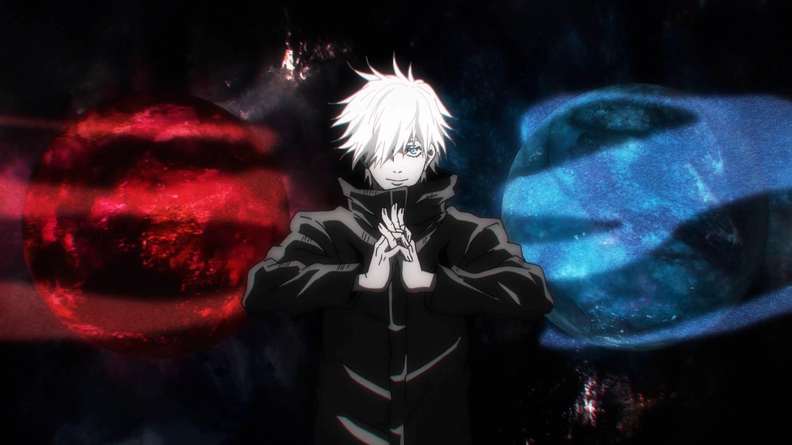

# Desvendando Satoru Gojo: O Feiticeiro Mais Poderoso de Jujutsu Kaisen 🌌

## 🚀 Introdução

Desde sua primeira aparição em "Jujutsu Kaisen", Satoru Gojo se tornou um dos personagens mais icônicos e poderosos do universo dos mangás. Sua personalidade intrigante, poderes avassaladores e filosofia única o tornam não apenas um protagonista cativante, mas também uma figura emblemática na cultura pop contemporânea. Este ebook é uma exploração profunda de quem é Satoru Gojo, o que o torna tão especial e por que ele captura a imaginação de tantos fãs ao redor do mundo.

## 📒 Descrição

> **Capítulo 1: Quem é Satoru Gojo?**

Neste capítulo, exploraremos a história e a personalidade de Satoru Gojo. Desde sua introdução na série até seu papel como mentor e guia para os personagens principais, analisaremos como sua natureza descontraída e confiante contrasta com sua imensa força e habilidades.

> **Capítulo 2: Poderes e Habilidades**

Satoru Gojo é conhecido por seu domínio absoluto sobre a técnica de "Infinito" e por sua capacidade de manipular o espaço. Este capítulo investiga a mecânica por trás de seus poderes, explicando como ele os usa em batalha e como sua habilidade única o coloca acima de seus adversários.

> **Capítulo 3: Filosofia e Ensinos**

Além de ser um mestre em combate, Gojo também é um pensador profundo. Ele possui uma visão única sobre a vida, a morte e o papel dos feiticeiros na sociedade. Aqui, discutiremos as crenças e os ensinamentos que ele transmite aos seus alunos, destacando como essas ideias moldam não apenas a série, mas também os espectadores.

> **Capítulo 4: Impacto Cultural e Popularidade**

Satoru Gojo não é apenas um personagem dentro de "Jujutsu Kaisen", mas também um fenômeno cultural. Neste capítulo, examinaremos seu impacto na cultura pop japonesa e global, desde memes até produtos licenciados, e como ele se tornou um dos personagens mais populares da atualidade.

> **Capítulo 5: O Futuro de Satoru Gojo**

Embora a série "Jujutsu Kaisen" ainda esteja em andamento, especularemos sobre o futuro de Satoru Gojo. Como seu desenvolvimento como personagem pode evoluir? Que desafios futuros ele pode enfrentar? Este capítulo é uma análise das possibilidades e expectativas para o futuro do feiticeiro mais poderoso.

> **Conclusão**

Satoru Gojo é mais do que apenas um personagem em um mangá; ele é uma figura que ressoa com muitos pela sua complexidade, força e carisma. Este ebook foi uma tentativa de capturar sua essência e explorar o que o torna tão fascinante para os fãs de "Jujutsu Kaisen" em todo o mundo.

## 🤖 Tecnologias Utilizadas
- [Chat GPT](https://chatgpt.com/)
- [Pinterest](https://br.pinterest.com/)

## 🧐 Processo de Criação
Descreva como você criou o conteúdo

## 🚀 Resultados
O projeto de utilizar a inteligência artificial como "amigo" no desenvolvimento é interessante. Com a DIO, consegui explorar bastante este uso e melhorar minhas capacidades com tais ferramentas.

## 💭 Reflexão (Opcional)
Espero que este ebook tenha proporcionado uma visão aprofundada e interessante sobre Satoru Gojo. Se você é um fã de "Jujutsu Kaisen" ou simplesmente ficou curioso sobre esse personagem, espero que tenha encontrado esta leitura informativa e divertida. Obrigado por ler!

Gege Akutami é um entusiasta de mangás e cultura pop japonesa, apaixonado por explorar os temas e personagens que capturam a imaginação dos fãs ao redor do mundo.

## Links Interessantes

[Base10: If You’re Not First, You’re Last: How AI Becomes Mission Critical](https://base10.vc/post/generative-ai-mission-critical/)

